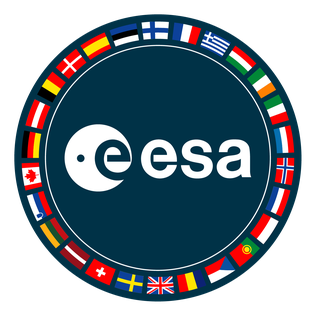
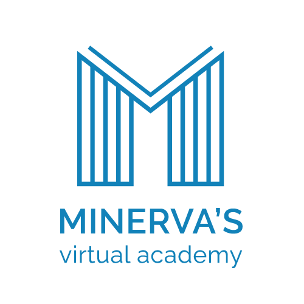
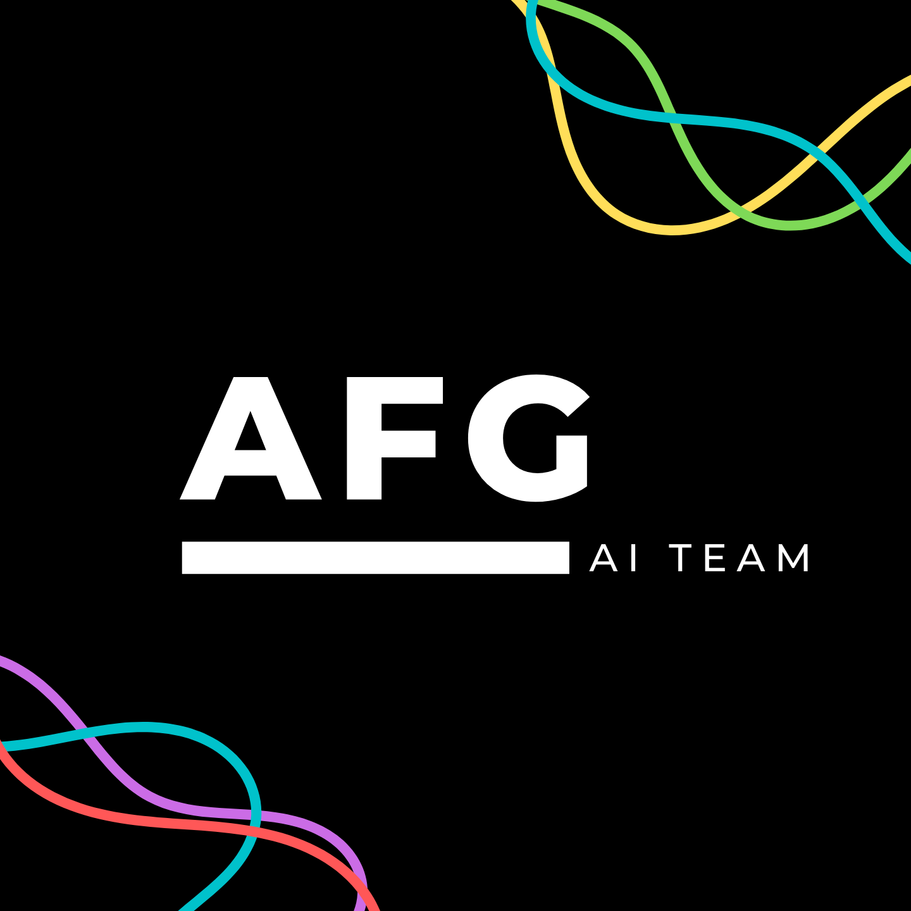

# AstroPi-CloudGAN
<table><tr>
<td>  </td>
<td>  </td>
<td>  </td>
</tr></table>

### **TEAM NAME -** Artifigentia **[AFG]**  
### **TEAM MEMBERS -** [Alexander Malinin](https://www.linkedin.com/in/alexander-m-69570b210), Ivan Lazarev, Rita Maria Cappello
 

### **💡 Experiment Idea**
Our experiment idea is to see if Artificial Intelligence, specifically GANs using the inpainting method, can accurately predict, construct, and reconstruct digitally the surface underneath cloud-covered areas in top-of-atmosphere images of Earth. This neural network would run on images and potentially video, and tuned to run on low performance microchips and computers so that it could fit any potential use scenario; from hobbyist projects to computationally powerful satellites. The AstroPi would provide the experimental project a very useful realistic use scenario, and the generated data and code will be made public for future contestants to utilize and learn from under the MIT license on GitHub.

In our background and preliminary research in the topic of cloud-removal GANs we were shocked to find out that according to a [reputable study](https://ieeexplore.ieee.org/document/6422379) about 67 percent of Earth's surface is typically covered by clouds. Paired with the fact that 50% of Earth is dark and unobservable to visible light spectrum satellites and cameras, any given surface of Earth is fully visible only roughly 17% of the time. Our hypothesis is that our GAN will be able to accurately predict the surface underneath cloud covered areas, rendering potentially deprecated visible light spectrum satellites revitalized or useful for longer, and grant them more capability through a larger scope of observation at any given time of day. Our model’s inference time per image should only take a maximum of a few seconds, not compromising the image’s legitimacy or work speed of the machine the model is running on.

### **📝 Background Research**

In the beginning of our team’s formation we thought of many conceptually intriguing projects that all failed because of practicality. One such idea was a machine learning algorithm that could predict the amount of human population in a given photo, but we realized that a huge obstacle to the implementation of such an idea is that almost all parts of a given image are obstructed by clouds, and makes the algorithm almost completely useless. This is when the idea of a cloud removal tool came to mind as a serious potential project to solve such issues going forward for others and our team. Ideally our GAN will be able to predict the surface of the earth with higher than 90% accuracy in optimal conditions, becoming a serious tool instead of a toy that just makes images appealing to the eye. Recalling all the research we did on previous winners of AstroPi, we took useful information about red-channel cloud isolation on images from team Centauri that will be useful for masking images, and drew some inspiration from team Nanokids who trained their ML model to classify types of clouds. We did not find any other teams who did cloud related projects, or any solutions besides AI and large, expensive, new satellite technology to the problem of cloud image obstruction. Our team has extensive experience with programming in python, the Raspberri Pi, advanced mathematics, and most importantly we are passionate and excited to build an AI model from scratch, using Tensorflow, Earth Engine, and Google Cloud to train the model. We are competent in Git and GitHub, and plan to document the entire process from start to finish in a wiki that others can open at any time and learn from.

Machine learning in such an application has been done before by researchers from the University of Osaka who trained their cloud-removal GAN model on a GTX 1060 GPU, and a startup company Ubotica who launched their AI cloud-removal satellite into orbit in partnership with ESA and Intel in late 2020. Instead of making us feel hopeless, this brought excitement and inspiration to try and outcompete existing GAN models currently in use. We have access to way more (>100x teraflops) processing power than the researchers at the University of Osaka had with our leverage of Google Cloud, and access to petabytes of data from Earth Engine that can all be used in tandem to train our model more efficiently than what has been done in the past. What we understand from research is that cloud-removal algorithms are more useful the more zoomed-in the image is to Earth, however this algorithm, being a scientific project, even still would most likely be able to succeed at extreme use case scenarios (2x-8x zoom than the AstroPi camera on board the ISS). The more transparent the clouds are the better the model is due to more relevant available data points for interpolation, but interpolation of non-transparent clouds will be the project’s target as it is the hardest and most beneficial.

### **🔬 Benefits of this experiment**

[IN PROGRESS]

### **🛠️ Methods**

[IN PROGRESS]

### **🔍 Post-experiment analysis**

[IN PROGRESS]
